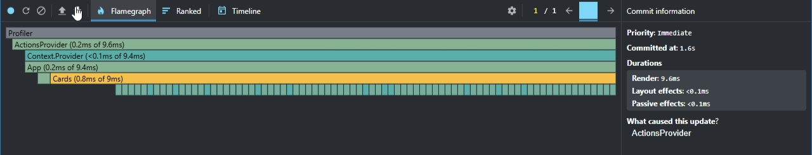
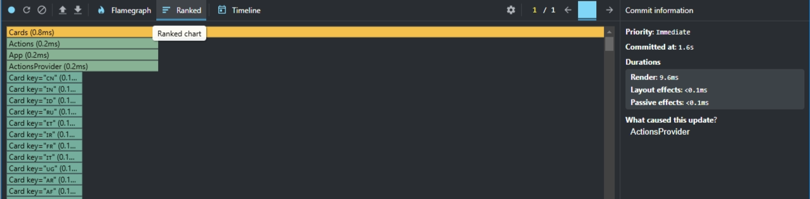
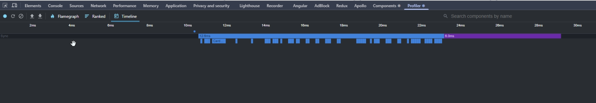
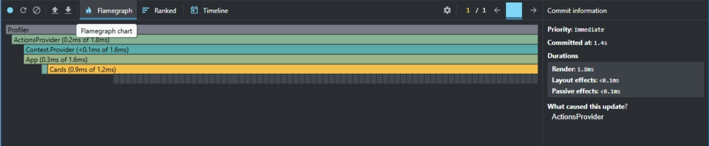
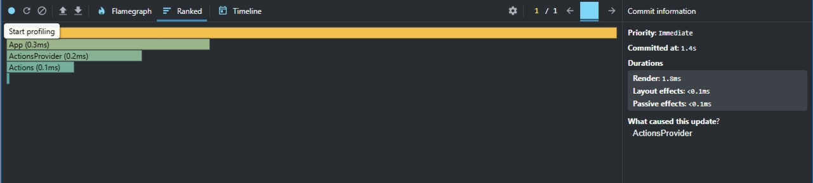
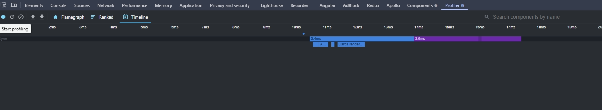

# React Performance Optimization

This branch contains my implementation of **React performance optimization techniques** as part of the **React course** at [Rolling Scopes School (RS School)](https://rs.school/).

## 📌 Topics Covered
- **`useCallback`** – Memoizing functions to prevent unnecessary re-creations.
- **`useMemo`** – Optimizing expensive calculations by memoizing values.
- **`React.memo`** – Preventing unnecessary re-renders of components.
- **React Profiler** – Measuring and analyzing component render performance.

## 📉 Performance Summary

The React Profiler was used to measure and analyze the rendering performance of the application. I measured the performance by setting regions as 'All' and changing the sorting of all cards in the application. Below are the key findings:

### Initial Profiling Without Optimization

- **Commit Duration:** 1.6s
- **Render Duration:** 9.6ms
- **Flame Graph:**
  
- **Ranked Chart:**  
  
- **Interactions:**  
  

### Updated with React.memo and useMemo

- **Commit Duration:** 1.4s
- **Render Duration:** 1.8ms
- **Flame Graph:**
  
- **Ranked Chart:**  
  
- **Interactions:**  
  

### Performance Improvement

By implementing **React.memo** and **useMemo**, I was able to reduce the **commit duration** by approximately **12.5%** and the **render duration** by around **81.25%**, significantly improving the application's performance, especially during re-renders.

## 🚀 Technologies Used
- `useCallback` (Function memoization)
- `useMemo` (Value memoization)
- `React.memo` (Component optimization)
- React Profiler (Performance measurement)

This branch focuses on **minimizing re-renders, optimizing performance, and analyzing component behavior** in React applications.
